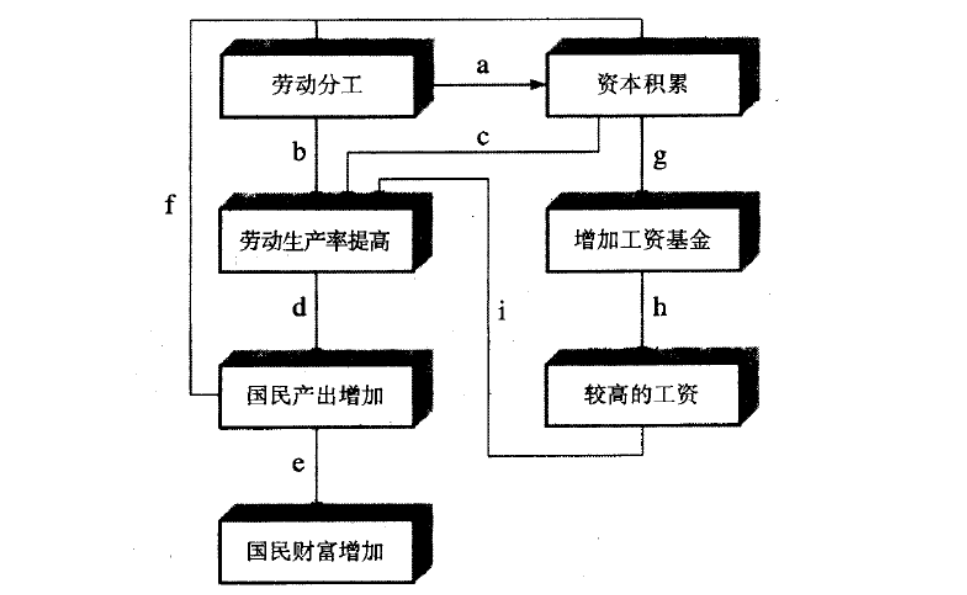

|学年学期|2024-2025学年第一学期|
|------------|---------------|
|自然学期|2024年秋季学期|
|正式名称|经济思想史|
|使用教材|课件|
|参考教材|Brue & Grant|
|辅助教材|史晋川|
|学生层次|本科生|

```text title="学校本科教务系统课程序号"
ECON0031131042.01
```

## 1 导论

## 2 古典学派的分化

### 2.1 重商和重农主义

### 2.2 Adam Smith

#### 2.2.1 概览

##### 2.2.1.1 内部关系图


##### 2.2.1.2 历史背景

##### 2.2.1.3 基本信条

古典学派－经济自由主义  
- 最低限度的政府干预
- 自利的经济行为
- 利益的和谐（李嘉图除外，个人利益 → 社会利益）
- 所有的经济资源（土地、劳动力、企业家才能）和经济活动（农业、商业、工业生产、国际贸易）都很重要
- 经济规律是普遍的且无法改变的  
如劳动价值理论，萨伊定律，人口论，地租理论，比较优势理论

##### 2.2.1.4 人物概览

#### 2.2.2 本身

##### 2.2.2.1 《国富论》

##### 2.2.2.2 分工

斯密把分工看作是劳动生产率提高的最大贡献者。　　
>（摘自《国富论》第一章）  
> 劳动生产力的最大改进，以及劳动在任何地方运作或应用中所体现的技能、 熟练和判断的大部分，似乎都是劳动分工的结果。

> 由于实行劳动分工的所有不同行业的产量成倍增长，在治理很好的社会出现普遍的富裕。

##### 2.2.2.3 增长的源泉

##### 2.2.2.4 利益和谐

##### 2.2.2.5 市场调节

##### 2.2.2.6 Smith 简图



#### 2.2.3 观察

##### 2.2.3.1 长远影响

- 为经济学奠定了坚实的社会哲学基础，从而有利于其今后在更广阔的领域、空间发展。  
- 第一次使经济学成为一门比较系统化的社会科学。  
- 经济自由主义的奠基人。

##### 2.2.3.2 经济自由是绝对的吗

- 自由放任主义在处理哪些经济问题上是不足够的？  
- 西方国家以政治自由为条件给非洲政府经济援助，希望达到经济自由促进经济增长。30年过去了，受援助的非洲国家陷入内乱中，经济并无起色。

##### 2.2.3.3 对市场有效的批评

> 张维迎《新古典经济理论的八大悖论》之  
> 「看不见的手」与「别针工厂」（分工定理）的矛盾  
> 「市场的有效性以市场的不存在为前提」  
> - 「根据福利经济学第⼀定理，只有完全竞争市场才能达到帕累托最优，因⽽是最有效率的市场，任何偏离完全竞争都会导致资源配置的效率损失」  
> - 完全竞争的前提是没有规模经济  
> - 但市场存在的前提是分工和专业化，而分工和专业化的前提是报酬递增  
> - 「逻辑上，最有效率的市场以市场不存在为前提，导致市场出现的因素反倒成了市场失灵的因素」

### 2.3 Malthus

#### 2.3.1 概览

##### 2.3.1.1 人物概览

- 1766－1834
- 出生于英国一个土地贵族家庭，和休谟、卢梭等人都有交往，思想颇为激进。
- 1784年入剑桥大学耶稣学院学习。后又入剑桥大学。
- 1796年，他到萨立州的奥尔巴当牧师。
- 1798年代表作《人口论》。
- 1805年被聘为东印度学院的历史和政治经济学教授。
- 以人口论著名，但备受争议

##### 2.3.1.2 历史背景

#### 2.3.2 人口论

##### 2.3.2.1 本身

##### 2.3.2.2 政策含义

- 节育政策、反对废除战争和补贴穷人的政策
> 无论生活资料以多么快的方式增长，人口的增长总会受到它的限制。所有在保持正常的人口水平之外出生的儿童必然都将面临死亡，除非成人死亡为他们腾出生存空间……从而，我们应该促进大自然在制造死亡率方面的作用，而不应阻碍其作用……我们不应该鼓励建议穷人保持清洁卫生，而是应该鼓励相反的习惯。在我们的城镇里，我们应该使街道变得更窄，让房子里住进更多的人，从而招致瘟疫的发生。在农村，我们应该将村子建在死水塘附近，并且特别鼓励定居在沼泽地及其他不卫生的地方……  
- 如何评价？

##### 2.3.2.2 人口论影响

- 直接导致英国1834《济贫法》的修正：使公共救助让人无法忍受。
- 托马斯·卡莱尔（十九世纪中期的史学家）读了马尔萨斯的著作后，称政治经济学「十分可怕」！
- 人口论的相对适用性：关于人口增长与贫困、营养不良、疾病的预测在贫穷的国家仍是非常真实的；2000—2010年，世界上每出生10个人，9个生活在发展中国家

##### 2.3.2.3 历史借鉴

- 阿玛蒂亚 · 森的饥荒理论
- 繁荣饥荒和衰退饥荒
> 阿玛蒂亚 · 森  
> 「饥荒的发生常常是在那些食物即使不充裕，至少也算足够维持人口补给的地方」

#### 2.3.3 供给过剩理论

##### 2.3.3.1 本身

- 古典学派多认为只存在某些特殊商品的过剩，或称局部过剩，一般商品过剩则不存在。  
（供给创造本身的需求，萨伊法则）

- 马尔萨斯有效需求不足理论  
    因为工人阶级的工资不可能超出产出价值，所以不能购买全部的社会产出；资本家会以资本品的形式购回部分产出，但他们的目标是积累财富。因此资本主义社会就存在着一般商品生产过剩的可能性。（凯恩斯思想的理论渊源）

##### 2.3.3.2 对供给过剩的政策建议