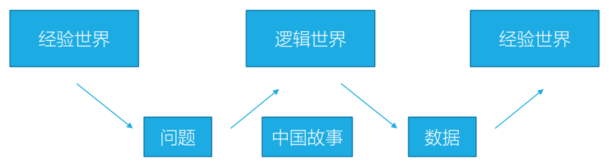
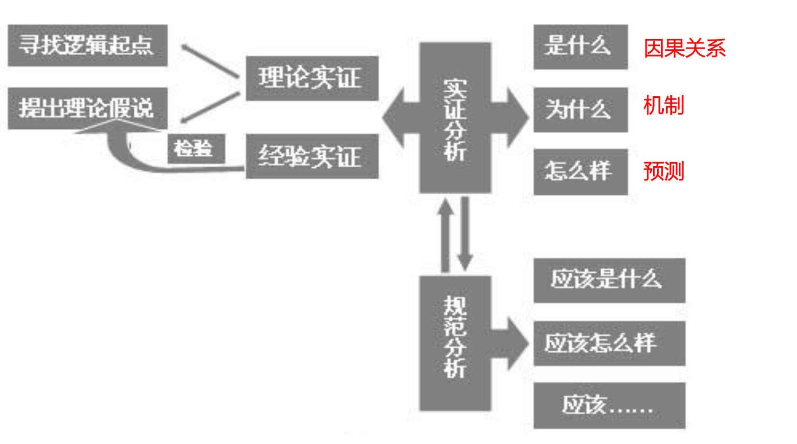

|学年学期|2024-2025学年第一学期|
|---|---|
|自然学期|2024年秋季学期|
|正式名称|经济思想史|
|使用教材|课件|
|参考教材|Brue & Grant|
|辅助教材|史晋川|
|学生层次|本科生|

```text title="学校本科教务系统课程序号"
ECON0031131042.01
```

## 1 导论

### 1.1 课程目标与特点

经济学思想的发展不能脱离经济环境。  
不能断言某一种思想先进或落后（正确或错误）  
——只能说是否解决了当时社会经济问题。  
每个流派得到的对经济问题的认识都是部分正确。  
因此，经济思想史需置于经济史的动态发展中理解。

#### 关键问题

1. 学派产生的历史背景是什么？  
大部分经济理论（通常是革命式的）产生于应对剧变的经济环境  
2. 该学派的主要信条是什么？  
一般化与多样性  
3. 该学派对谁有利或为谁谋利？  
4. 该学派是如何在当时成为有效的理论体系的？  
过去的知识是过时和错误的？曾经正确的理论一直正确？  
5. 该学派的哪些信条具有长远影响？局限或错误？

### 1.2 经济学思想的源起

#### 社会背景

西方中世纪教会 → 欲望即罪恶  
中世纪后期宗教改革 → 享乐主义、个人主义、利己主义哲学：人的本性就是欲望（效用）满足  
古典时期 → 边沁的功利主义 (utilitarianism)：最大多数人的最大幸福

#### 两类问题

市场是如何产生的——哲学层次  
市场是如何运行的——实用主义

#### 经济学的「实用化」

> 在斯密之后，西方国家中法治化的市场经济运作体制生成，「市场经济理论传道人」的历史使命随之结束

> 新古典时期之后，经济学家们不再关心人类社会是如何运作的这类「经邦济世」的大学问了，而只是做些解释现实经济现象的「实际功夫」。——施蒂格勒

> 实证经济学在原则上是独立于任何价值判断的。作为一种实证科学，经济学是一种被尝试接受的、关于经济现象的概括体系，用以对条件变化的结果作出预测。——弗里德曼

>「庸俗经济学的丧钟已经敲响了」——《资本论》

>「经济学的本质是研究资源稀缺条件下，人类在配置资源方面是如何行为的一门形式化的社会科学。」——罗宾斯

##### 现代经济学的分析范式



##### 现代实证主义的分析范式



### 1.3 经济学流派概览

#### 经济史维度下的经济思想史

新的经济问题 → 新的政策建议 → 新的经济理论

人们只能根据时代需要寻找解决问题的理论办法，因此很多时候不能依据流行度评判流派或学说的优劣。


### 1.4 关于此课程

#### 课程学习要求

【基础】  
✓ 熟悉经济学基本理论：微观、宏观、计量

【方法】  
✓ 思维训练  
✓ 独立思考，批判式接受，大胆质疑，小心求证  

【目标】  
✓ 了解各时期构成主流经济学基本框架的重要理论  
✓ 找到感兴趣的领域，且理解、掌握、应用该领域的理论进展  

#### 推荐读物

[瑞典银行经济学奖](https://www.nobelprize.org/prizes/uncategorized/all-prizes-in-economic-sciences/)  
[克拉克奖](https://www.aeaweb.org/about-aea/honors-awards/bates-clark)  
*Journal of Economic Perspective*

## 2 古典经济学

### 2.1 早期经济学思想

#### 2.1.1 重商主义

#### 2.1.2 重农主义

### 2.2 亚当斯密＆古典经济学

#### 2.2.1 概览

##### 2.2.1.1 内部关系图


##### 2.2.1.2 历史背景

##### 2.2.1.3 基本信条

（古典学派－经济自由主义）  
- 最低限度的政府干预
- 自利的经济行为
- 利益的和谐（李嘉图除外，个人利益 → 社会利益）
- 所有的经济资源（土地、劳动力、企业家才能）和经济活动（农业、商业、工业生产、国际贸易）都很重要
- 经济规律是普遍的且无法改变的  
如劳动价值理论，萨伊定律，人口论，地租理论，比较优势理论

##### 2.2.1.4 人物概览

#### 2.2.2 本身

##### 2.2.2.1 《国富论》

##### 2.2.2.2 分工

斯密把分工看作是劳动生产率提高的最大贡献者。　　
>（摘自《国富论》第一章）  
> 劳动生产力的最大改进，以及劳动在任何地方运作或应用中所体现的技能、 熟练和判断的大部分，似乎都是劳动分工的结果。

> 由于实行劳动分工的所有不同行业的产量成倍增长，在治理很好的社会出现普遍的富裕。

##### 2.2.2.3 增长的源泉

##### 2.2.2.4 利益和谐

##### 2.2.2.5 市场调节

##### 2.2.2.6 Smith 简图


#### 2.2.3 观察

##### 2.2.3.1 长远影响

- 为经济学奠定了坚实的社会哲学基础，从而有利于其今后在更广阔的领域、空间发展。  
- 第一次使经济学成为一门比较系统化的社会科学。  
- 经济自由主义的奠基人。

##### 2.2.3.2 经济自由是绝对的吗

- 自由放任主义在处理哪些经济问题上是不足够的？  
- 西方国家以政治自由为条件给非洲政府经济援助，希望达到经济自由促进经济增长。30年过去了，受援助的非洲国家陷入内乱中，经济并无起色。

##### 2.2.3.3 对市场有效的批评

> 张维迎《新古典经济理论的八大悖论》之  
> 「看不见的手」与「别针工厂」（分工定理）的矛盾  
> 「市场的有效性以市场的不存在为前提」  
> - 「根据福利经济学第⼀定理，只有完全竞争市场才能达到帕累托最优，因而是最有效率的市场，任何偏离完全竞争都会导致资源配置的效率损失」  
> - 完全竞争的前提是没有规模经济  
> - 但市场存在的前提是分工和专业化，而分工和专业化的前提是报酬递增  
> - 「逻辑上，最有效率的市场以市场不存在为前提，导致市场出现的因素反倒成了市场失灵的因素」

### 2.3 马尔萨斯＆人口论

#### 2.3.1 概览

##### 2.3.1.1 人物概览

- 1766－1834
- 出生于英国一个土地贵族家庭，和休谟、卢梭等人都有交往，思想颇为激进。
- 1784年入剑桥大学耶稣学院学习。后又入剑桥大学。
- 1796年，他到萨立州的奥尔巴当牧师。
- 1798年代表作《人口论》。
- 1805年被聘为东印度学院的历史和政治经济学教授。
- 以人口论著名，但备受争议

##### 2.3.1.2 历史背景

#### 2.3.2 人口论

##### 2.3.2.1 本身

##### 2.3.2.2 政策含义

- 节育政策、反对废除战争和补贴穷人的政策
> &emsp;&emsp;无论生活资料以多么快的方式增长，人口的增长总会受到它的限制。所有在保持正常的人口水平之外出生的儿童必然都将面临死亡，除非成人死亡为他们腾出生存空间……从而，我们应该促进大自然在制造死亡率方面的作用，而不应阻碍其作用……我们不应该鼓励建议穷人保持清洁卫生，而是应该鼓励相反的习惯。在我们的城镇里，我们应该使街道变得更窄，让房子里住进更多的人，从而招致瘟疫的发生。在农村，我们应该将村子建在死水塘附近，并且特别鼓励定居在沼泽地及其他不卫生的地方……  
- 如何评价？

##### 2.3.2.2 人口论影响

- 直接导致英国1834《济贫法》的修正：使公共救助让人无法忍受。
- 托马斯·卡莱尔（十九世纪中叶的史学家）读了马尔萨斯的著作后，称政治经济学「十分可怕」！
- 人口论的相对适用性：关于人口增长与贫困、营养不良、疾病的预测在贫穷的国家仍是非常真实的；2000—2010年，世界上每出生10个人，9个生活在发展中国家

##### 2.3.2.3 历史借鉴

- 阿玛蒂亚 · 森的饥荒理论
- 繁荣饥荒和衰退饥荒
> 阿玛蒂亚 · 森  
> 「饥荒的发生常常是在那些食物即使不充裕，至少也算足够维持人口补给的地方」

#### 2.3.3 供给过剩理论

##### 2.3.3.1 本身

- 古典学派多认为只存在某些特殊商品的过剩，或称局部过剩，一般商品过剩则不存在。  
（供给创造本身的需求，萨伊法则）

- 马尔萨斯有效需求不足理论  
    因为工人阶级的工资不可能超出产出价值，所以不能购买全部的社会产出；资本家会以资本品的形式购回部分产出，但他们的目标是积累财富。因此资本主义社会就存在着一般商品生产过剩的可能性。（凯恩斯思想的理论渊源）

##### 2.3.3.2 对供给过剩的政策建议

### 2.4 李嘉图

#### 2.4.1 概览

#### 2.4.2 劳动价值论

##### 2.4.2.1 内容

##### 2.4.2.2 矛盾

#### 2.4.3 地租理论

**广延边际地租** / 第一类级差地租  
土地肥力差异引起级差地租

**集约边际地租** / 第二类级差地租  
不同集约度（投资水平）土地上耕种所得收益差异引起级差地租（集约耕种的边际产量递减）

:::tip[剩余原理 / Leftover Principle]
前提：土地总量固定  
对土地的竞争导致投资的经济利润 $=0$  
地租 $=$ 非土地成本之外的经济剩余
:::

#### 2.4.4 分配论

##### 2.4.4.1 工资

工人在长期仅得到维持个人和家庭生活的最低工资——「工资铁律」

##### 2.4.4.2 利润

一国不同行业间的企业利润率趋于均等化  
产出价格的变化影响利润率进而影响资本的流动
- 长期来看，利润下降
- 利润率的下降不利于资本积累和投资，因此在经济政策上李嘉图反对地主阶级为维持高地租而实施的干预——反对《谷物法》

##### 2.4.4.3 地租

长期来看，地租上升

#### 2.4.5 比较优势

### 2.5 边沁｜萨伊｜穆勒

#### 2.5.1 边沁 Jeremy Bentham

功利主义  
- 哲学基础：享乐主义 Hedonism  
（人们追求可以带来快乐的东西，回避会产生痛苦的东西）
- 道德伦理原则：应引导人们的行为使之促进最大多数人的最大幸福  
- 「效用」的概念

政策含义  
> 若政府的一项措施所增加的集体的幸福大于所减少的幸福，则这些政府措施被认为是符合效用原理的

:::tip[历史意义]
功利主义构成了边际学派的理论基础  
——效用最大化和边际效用递减的概念

通过比较成本与收益而进行理性选择的多数现代经济学思想，都植根于边沁提出的人类行为概念。

现代经济学在此基础上考虑了人们行为的其他动机  
歧视、婚姻、犯罪、吸毒……  
> 加里 · 贝克尔《人类行为的经济分析》

:::

#### 2.5.2 萨伊 Jean-Baptiste Say

「萨伊定律」供给会创造出它自己的需求  
（新古典经济学的理论基础）

- 否认资本主义生产过剩经济危机爆发的可能性

三原理  
- 产品是以产品来购买的，货币只不过是交换的媒介
- 生产给产品创造需求
- 只要对生产不加干涉，就不会发生普遍生产过剩

#### 2.5.3 穆勒 John Stuart Mill

1848 年出版代表作《政治经济学原理》

教育经历严苛  
- 13 岁学习政治经济学  
- 15—18 岁编辑出版了边沁的 5 卷手稿  
- 19 岁开始发表独创性学术论文  
- 20 岁得了神经衰弱  

他成年时，古典学派开始衰败

### 2.6 古典学派的主要成就

(1)劳动成本说：劳动是主要的成本，会影响相对价格

(2)货币的中立性：货币是一层面纱，外汇与货币供给的增加，只会改变物价，不会改变国家的财富

(3)劳动与资本的比例固定：在技术创新不明显的时代，劳动与资本的搭配比例，在短时间内不易改变

(4)农业部门的报酬递减，工业部门的报酬大致固定，要到19世纪中叶才出现报酬递增

(5)基本上假设充分就业——供给自动创造需求

(6)认为人口论（或马尔萨斯陷阱）是成立的

## 3 社会主义＆马克思

### 3.1 社会主义

### 3.2 科学社会主义

#### 3.2.1 概括

:::tip[关键词]
- 历史唯物主义
- 劳动价值论
- 剥削
- 资本积累和利润率下降
- 资本积累和经济危机
:::

劳动价值论与资本剥削劳动  
> 商品的价值来自于社会必要劳动——绝对价值
> 资本家以低于商品价值的工资雇佣劳动获取剩余利润，是剥削

#### 3.2.2 资本主义运动规律

:::info[资本积累与利润率下降]
&emsp;&ensp;资本积累  
$\Rightarrow$ 生产效率提高  
$\Rightarrow$ 资本替代劳动（技术性失业）  
$\Rightarrow$ 劳动力是唯一价值来源，利润率下降
:::

:::info[资本积累与经济危机]
&emsp;&ensp;资本积累  
$\Rightarrow$ 生产扩张，生产能力过剩  
$\Rightarrow$ 有效需求不足  
$\Rightarrow$ 经济危机  
$\Rightarrow$ 失业与萧条；企业兼并，资本集中  
$\Rightarrow$ …… $\Rightarrow$ 阶级斗争
:::

#### 3.2.3 主要贡献

- 最早注意到经济周期是资本主义的常见现象
- 1930年和2008年全球金融危机爆发，背后的实质原因是全球经济的非均衡，是全球在当前收入分配之下所形成的总需求无法吸纳全球总供给。从这个角度看，马克思的理论没有过时
- 正确地预测了大规模企业和垄断力量的增长
- 强调动态的而不是静态的分析

### 3.3 扩展讨论

2016年，中国超越日本成为全球工业机器人存量最大的国家
> 讨论：资本替代劳动——技术性失业？
---
新发展：21世纪的资本主义一般规律  
Thomas Piketty 21世纪资本论  
日益扩大的不平等

理论框架：马克思经济学 + 索罗增长理论

资本主义一般规律 $r>g$

$\text{资本回报率}>\text{经济增速}$

---

反对意见：Daron Acemoglu

马克思和皮克蒂的「资本主义一般规律」忽略了经济和政治制度扮演的作用以及技术的内生演变 (Acemoglu et al., 2015)

Karl Marx *The Poverty of Philosophy*
> the hand-mill gives you society with the feudal lord  
> the steam-mill society with the industrial capitalist

Acemoglu 主张这对因果关系是反过来的：  
生产关系（经济与政治制度）影响生产力（技术）进而影响劳动力需求  
[Acemoglu, D., & Robinson, J. A. (2015). The rise and decline of general laws of capitalism. Journal of Economic Perspectives, 29(1), 3–28.](https://www.aeaweb.org/articles?id=10.1257/jep.29.1.3)

---

当今的描述性统计  

中国  
[Piketty, T., Yang, L., & Zucman, G. (2019). Capital accumulation, private property, and rising inequality in china, 1978–2015. American Economic Review, 109(7), 2469–2496.
](https://doi.org/10.1257/aer.20170973)

日益扩大的不平等：代际流动性变差  
代际流动性：子代收入与亲代收入的关联（代际收入弹性）

美国梦的破灭：了不起的盖茨比曲线（艾伦 · 克鲁格）  
高度不平等的国家具有较低的代际流动性（较高的代际收入弹性）